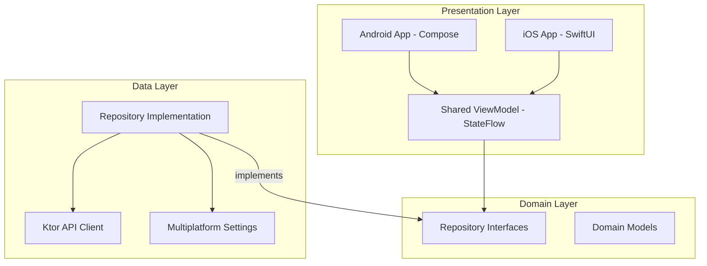

# 🚀 Pure KMP Template

A premium, production-ready starting point for your next **Kotlin Multiplatform (KMP)** project. This template is designed with a focus on clean architecture, performance, and a stunning developer experience.

## 🌟 Key Features

- **Shared Core Logic**: Business logic, networking, and state management are 100% shared across Android and iOS.
- **Advanced Authentication**:
    - Complete login/logout flow integrated with [DummyJSON](https://dummyjson.com).
    - Session persistence using `multiplatform-settings`.
    - Token-based authentication support (Access & Refresh tokens).
- **Clean Architecture**: Strictly follows the **Domain-Data-Presentation** pattern.
- **Modern UI Stack**:
    - **Android**: Jetpack Compose with Material 3.
    - **iOS**: SwiftUI with seamless shared ViewModel integration.
- **Performance Focused**: 
    - Optimized network calls with **Ktor**.
    - Efficient image loading on Android with **Coil**.
- **Modern Build System**: Centralized dependency management via Gradle Version Catalog.

## 🛠️ Tech Stack

| Layer | Technology |
| :--- | :--- |
| **Language** | Kotlin 2.0.21 |
| **Networking** | [Ktor 3.0+](https://ktor.io/) |
| **Dependency Injection** | [Koin 4.0+](https://insert-koin.io/) |
| **Local Storage** | [Multiplatform Settings](https://github.com/russhwolf/multiplatform-settings) |
| **Serialization** | Kotlinx Serialization |
| **Image Loading** | Coil 3.0 (Android) |
| **Concurrency** | Kotlin Coroutines |

## 📁 Project Architecture



## 🔑 Authentication Flow

The template includes a pre-configured authentication system.

**Test Credentials (DummyJSON):**
- **Username**: `emilys`
- **Password**: `emilyspass`

The `AuthViewModel` manages the `AuthUiState` (Idle, Loading, Success, Error) and exposes it as a `StateFlow`, ensuring a reactive UI on both platforms.

## 🏁 Getting Started

### 1. Prerequisites
- **Android Studio Koala** or newer.
- **Xcode 15+** (for iOS).
- **Kotlin Multiplatform Mobile** plugin.

### 2. Setup
```bash
# Clone the repository
git clone <repository-url>

# Open in Android Studio and Sync Gradle
```

### 3. Running the App
- **Android**: Select the `androidApp` configuration and click **Run**.
- **iOS**: 
    - Open `iosApp/iosApp.xcodeproj` in Xcode.
    - Build and Run on a simulator or physical device.

## 📄 License
This project is licensed under the MIT License - see the [LICENSE](LICENSE) file for details.
